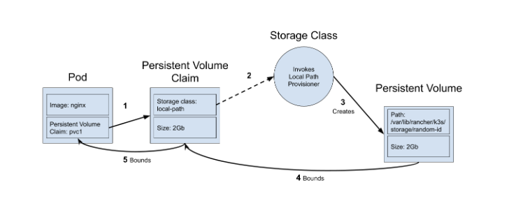

Inter pod communication happens over service and its port number . K8s DNS resolves the service name to redirect request to respective app.
 
Intrapod communication happens over the localhost. Because are in the same network inside the pod.

When dealing with multiple pods that has access to a volume, A normal volume can lead to data corruption hance we use statefulset it is similar to deployments but difference is it creates pods that has same identity as the pod that died.

scaled pods has their own storage, stateful apps has state stored inside the app not on outside like DB.

Statefulsets do not dele the volumes they are associated with.

StatefulSet requires a "Headless Service" to be responsible for the network identity. Let us start by defining a "headless service" with clusterIP: None, this will instruct Kubernetes not to do proxying or load balancing, but instead allow direct access to the Pods
